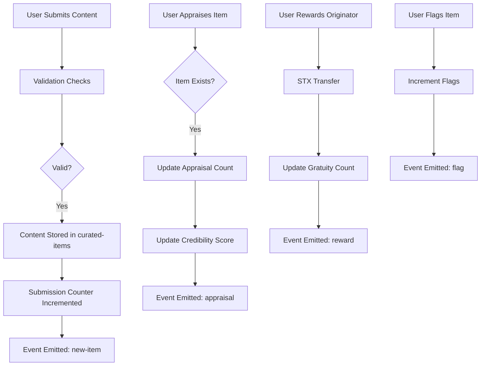

# 📚 StacksFlow Protocol

**Decentralized Content Quality Assurance Network Secured by Bitcoin**

---

## 🌐 Overview

**StacksFlow** is a decentralized protocol that leverages Bitcoin's security and the Stacks smart contract layer to curate, validate, and reward high-quality digital content through a community-governed model. It is a trustless system where users submit content, appraise submissions, and reward creators—forming a self-sustaining ecosystem that eliminates intermediaries and amplifies collective intelligence.

---

## 🚀 Key Features

* **Bitcoin-Secured Validation**: All content validation and governance actions are secured by the Bitcoin blockchain through the Stacks infrastructure.
* **Community-Driven Curation**: Decentralized submission and appraisal process empowers users to elevate valuable content.
* **Direct Creator Monetization**: Peer-to-peer STX gratuity transfers directly reward content originators.
* **Stake-Weighted Governance**: Influence is earned through reputation, not privilege.
* **Transparent Moderation**: Community-flagging enables distributed moderation without centralized oversight.
* **Expandable Taxonomy**: Supports dynamic topic onboarding to adapt to emerging content domains.

---

## 🧠 System Overview

StacksFlow implements a **content-centric validation system** using Clarity smart contracts. Participants engage in three primary roles:

1. **Contributors** – Submit content into the system.
2. **Appraisers** – Evaluate submissions through binary voting (upvote/downvote).
3. **Supporters** – Tip high-quality creators via STX transfers.

The protocol encourages **constructive behavior** through:

* **Reputation Accrual** (`participant-credibility`)
* **Content Visibility** (based on `appraisals`)
* **Monetary Rewards** (`gratuities`)

All actions are recorded immutably on-chain, ensuring auditability and trust.

---

## 🏛️ Contract Architecture

### ✅ Public Functions

| Function                   | Description                                          |
| -------------------------- | ---------------------------------------------------- |
| `contribute-item`          | Submit new content with headline, link, and topic.   |
| `appraise-item`            | Binary vote (1 or -1) on existing content.           |
| `reward-originator`        | Transfer STX to content creator.                     |
| `flag-item`                | Community moderation flag for inappropriate content. |
| `adjust-submission-charge` | (Admin) Set new submission fee.                      |
| `expunge-item`             | (Admin) Emergency removal of content.                |
| `introduce-topic`          | (Admin) Add a new content topic to taxonomy.         |

---

### 🔍 Read-Only Queries

| Query                              | Purpose                                       |
| ---------------------------------- | --------------------------------------------- |
| `retrieve-item-details`            | Get full metadata for a content item.         |
| `retrieve-participant-appraisal`   | View user's vote on a specific item.          |
| `retrieve-aggregate-submissions`   | Get current submission count.                 |
| `retrieve-participant-credibility` | Check user’s reputation score.                |
| `get-item-ids`                     | Generate list of content item IDs.            |
| `retrieve-top-items`               | Filter and retrieve positively rated content. |

---

## 🧱 Data Structures

### `curated-items`

Stores complete metadata for all submissions:

```clojure
{ 
  item-identifier: uint,
  originator: principal,
  headline: string,
  hyperlink: string,
  topic: string,
  publication-epoch: uint,
  appraisals: int,
  gratuities: uint,
  flags: uint
}
```

### `participant-appraisals`

Tracks appraisal history per user per item.

### `participant-credibility`

Tracks user reputation based on voting behavior.

---

## 🔁 Data Flow Summary



---

## ⚙️ Protocol Constants & Parameters

| Parameter              | Value             | Purpose                        |
| ---------------------- | ----------------- | ------------------------------ |
| `MIN_HYPERLINK_LENGTH` | 10                | Prevents empty or spam links.  |
| `submission-charge`    | Dynamic           | Fee to discourage spam.        |
| `MAX_UINT`             | 2^128 - 1         | Overflow protection for uints. |
| `content-topics`       | Initial list of 5 | Categorization taxonomy.       |

---

## 🔐 Governance and Administration

* **PROTOCOL\_ADMINISTRATOR**: Has exclusive rights to modify protocol parameters, introduce topics, and remove malicious content.
* **Fee Adjustment**: Submission cost can be adapted to market conditions.
* **Taxonomy Management**: Topics are capped at 10 but dynamically expandable.
* **Emergency Moderation**: Admins can expunge harmful or illegal content.

---

## 📊 Reputation System

Each participant builds a **credibility score** by:

* Upvoting good content
* Downvoting bad content
* Participating actively in curation

This score influences their long-term weight in governance-related features (future-proofing for DAO integration).

---

## 🧩 Future Extensions

* **Decentralized Arbitration**: Integrate staking-based dispute resolution.
* **Reputation-weighted Voting**: Enable score-based voting influence.
* **Topic DAO Modules**: Allow communities to self-govern topic-specific moderation.
* **NFT-based Content Badges**: Reward top-rated items with verifiable NFTs.

---

## 📄 License

StacksFlow is licensed under **MIT**.

---

## 🤝 Contributing

Contributions are welcome. Please submit a PR or open an issue. For governance changes, coordinate via the [StacksFlow Governance Forum](#).

---

## 🏁 Getting Started

* Deploy on **Stacks Mainnet** or **Testnet**
* Interact via Clarinet or Hiro Web Wallet
* Leverage the read-only interface for front-end content rendering

---

## 📬 Contact

For technical support or collaboration inquiries:

* Developer: **StacksFlow Core Dev Team**
* Email: `contact@stacksflow.org`
* Twitter: [@StacksFlow](https://twitter.com/stacksflow) *(placeholder)*

---

## 🔗 Related Technologies

* **Stacks** – Smart contracts secured by Bitcoin
* **Bitcoin** – Settlement layer for protocol trust
* **Clarity** – Predictable, secure smart contract language

---

## 📌 Final Notes

StacksFlow empowers communities to **validate**, **curate**, and **reward** content transparently and immutably—paving the way for a decentralized future of content assurance without gatekeepers.
